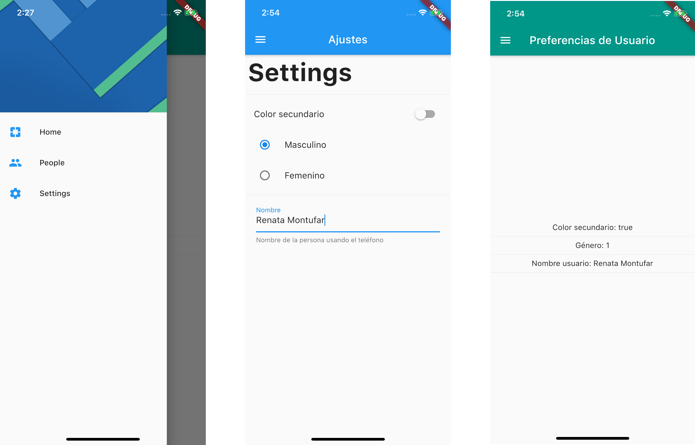

# Shared preferences app

This is a simple flutter project with Shared preferences for Android devices and User Defaults for iOS using shared_preferences package from https://pub.dev/packages/shared_preferences.

This is a practice excercise from Flutter: Tu guía completa de desarrollo para IOS y Android created by Fernando Herrrera

- Save on the Storage.
- Read from Storage.
- Create a Singleton



## Getting Started

```
flutter get packages
```
```
flutter run
```